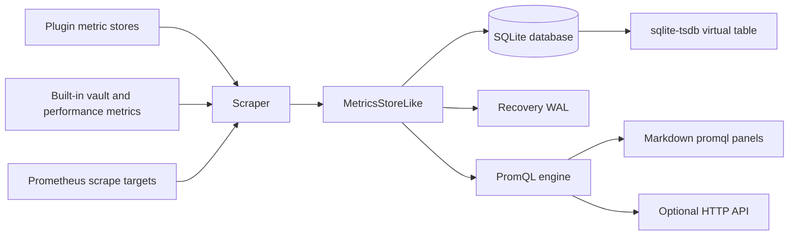

# Architecture

TSDB is a local time-series database for Obsidian. It records metrics from the
current vault, from other plugins, and from optional Prometheus scrape targets;
stores those samples in SQLite; and renders PromQL-backed charts directly in
notes.

This document describes the shipped architecture and the internal SQLite
extension that stores time-series samples.

## Design goals

- Keep all collected data local to the vault's Obsidian runtime.
- Make note panels and dashboards query the local database without requiring a
  Prometheus server.
- Let other plugins register metrics through a small Prometheus-style API.
- Keep ingestion cheap enough for one-second sources.
- Keep storage compact enough for long-running vaults.
- Preserve SQLite's transaction, recovery, and VFS behavior instead of building
  a separate database file format.

## System overview



The plugin is organized around these boundaries:

- `src/main.ts` owns the Obsidian lifecycle, settings, backend selection,
  scraper startup, Markdown processor registration, and optional HTTP server.
- `src/exporter/` owns metric registration and Prometheus-style metric
  collection.
- `src/scrape/` owns scrape scheduling, Prometheus exposition parsing, and
  conversion to stored samples.
- `src/storage/` owns SQLite access, worker transport, OPFS support, fallback
  VFSes, recovery WAL handling, and packed sample codecs.
- `src/promql/` owns parsing and evaluating the PromQL subset.
- `src/panels/` owns rendering fenced `promql` code blocks in notes.
- `sqlite-tsdb/` owns the custom SQLite extension.

## Data flow

1. A metric source is registered.
   - Built-in sources are registered during plugin load.
   - Other plugins call `plugin.api.getStore(name, options)`.
   - Prometheus scrape targets are configured in settings.

2. `Scraper` collects samples.
   - In-process sources are collected from `prom-client` registries.
   - External targets are fetched as Prometheus text exposition.
   - Every sample receives `job` and `instance` labels.
   - Synthetic scrape health samples are added: `up`,
     `scrape_duration_seconds`, and `scrape_samples_scraped`.

3. `MetricsStoreLike.ingest` commits samples to SQLite.
   - Labels are canonicalized and assigned integer series ids.
   - A scrape batch is encoded into one packed binary input blob.
   - The SQLite extension inserts or replaces samples inside one transaction.

4. The recovery WAL is appended after the SQLite commit.
   - SQLite is the durable source of truth.
   - The WAL is a replay source only when storage has to be recreated after
     unreadable or corrupt database state.

5. Queries read through `PromQLEngine`.
   - Panels query the store directly.
   - The optional HTTP API uses the same engine.
   - Prometheus is not required for note rendering.

## Metric registration

The public plugin API exposes named metric stores. Plugins can access it from
`app.plugins.plugins["tsdb"].api` after TSDB is loaded, or by listening for the
`tsdb:ready` workspace event:

```ts
const api = app.plugins.plugins["tsdb"].api.getStore("my-plugin", {
  intervalSeconds: 30,
  displayName: "My plugin metrics",
  description: "Operational metrics for my plugin.",
});

const queueDepth = api.createGauge({
  name: "queue_depth",
  help: "Current queue depth.",
});

queueDepth.set(12);
```

Each store has its own `prom-client` registry and recording interval. The store
name becomes the `job` label when TSDB records the samples. User settings can
enable, disable, or change the interval for each source without changing the
registering plugin.

Built-in stores use the same mechanism:

- `vault`: file activity, note counts, vault size, open notes, enabled plugins,
  and note view timing.
- `performance`: browser memory usage and selected Obsidian API timings.
- `tsdb`: internal scrape, ingest, WAL, API, and queue health.

## Query surfaces

### Note panels

TSDB registers a Markdown code block processor for fenced `promql` blocks.
Each block is parsed as either a bare PromQL expression or a YAML panel
configuration. The panel resolves its time range, expands time macros, queries
`PromQLEngine`, and renders the result with uPlot.

Panels subscribe to the global time context. The global time selector appears
only when the active note contains a `promql` block. Note frontmatter can
override `start`, `end`, or `step` for that note.

### HTTP API

The HTTP server is optional and disabled by default. When enabled, it binds to
localhost and exposes:

- the configured Prometheus exposition path, usually `/metrics`
- `/health`
- `/api/v1/query`
- `/api/v1/query_range`
- metadata endpoints backed by the local store

The server is a side feature. Panels do not call it; they use the local store
directly.

## Storage backends

The storage abstraction is `MetricsStoreLike`:

```ts
interface MetricsStoreLike {
  readonly isOpen: boolean;
  readonly recoveredFromCorruption: boolean;
  ingest(samples: StoredSample[]): Promise<void>;
  importSamples(samples: StoredSample[]): Promise<void>;
  select(matchers: Matcher[], startMs: number, endMs: number): Promise<SeriesData[]>;
  seriesMatching(matchers: Matcher[], startMs?: number, endMs?: number): Promise<Labels[]>;
  labelNames(matchers?: Matcher[]): Promise<string[]>;
  labelValues(labelName: string, matchers?: Matcher[]): Promise<string[]>;
  deleteBefore(cutoffMs: number): Promise<void>;
  quickStats(): Promise<QuickStoreStats>;
  stats(): Promise<StoreStats>;
  close(): Promise<void>;
}
```

The default backend is worker OPFS:

1. The renderer probes worker OPFS support.
2. If the probe succeeds, the renderer starts an inline worker.
3. The renderer transfers the synchronous `wa-sqlite` Wasm binary to the
   worker.
4. The worker opens SQLite with `AccessHandlePoolVFS`.
5. The renderer uses `WorkerMetricsStore`, a request/response proxy for
   `MetricsStoreLike`.

Fallback backends exist for development and explicit advanced use:

- `NodeFileVFS` stores a normal desktop `metrics.sqlite` file.
- `AdapterChunkVFS` stores SQLite pages through Obsidian's vault adapter.

Fallbacks are disabled by default. If worker OPFS cannot start, TSDB surfaces
the error instead of silently switching engines. A user can opt into fallback
storage by setting `storage.allowLegacyBackends` in `data.json`.

## SQLite schema

The plugin owns labels and metadata in normal SQLite tables:

```sql
CREATE TABLE IF NOT EXISTS series (
  id INTEGER PRIMARY KEY,
  labels_key TEXT NOT NULL UNIQUE,
  labels_json TEXT NOT NULL
);

CREATE TABLE IF NOT EXISTS store_meta (
  key TEXT PRIMARY KEY,
  value INTEGER NOT NULL
);

CREATE TABLE IF NOT EXISTS sample_rollup_1m (
  bucket_ms INTEGER PRIMARY KEY,
  sample_count INTEGER NOT NULL
);
```

Samples are stored through the custom virtual table:

```sql
CREATE VIRTUAL TABLE IF NOT EXISTS samples USING tsdb(
  block_span_ms=21600000,
  max_block_points=2048
);
```

`series` is normal SQLite data because label matching is handled in
TypeScript. The extension receives integer `series_id` values and focuses on
storing numeric samples efficiently.

`store_meta` and `sample_rollup_1m` keep common status calls inexpensive. For
example, recent sample counts can be answered without scanning compressed
sample blocks.

## SQLite extension deep dive

The `sqlite-tsdb` extension is the storage engine for the `samples` table. It
has no dependency on Obsidian, Prometheus, Electron, or `wa-sqlite`. It is a
normal SQLite extension that can be built natively for tests and statically
linked into the plugin's customized `wa-sqlite` Wasm artifacts.

The extension registers:

- virtual table module `tsdb`
- eponymous virtual table module `tsdb_batch`
- scalar function `tsdb_version()`
- aggregate function `tsdb_pack(ts, value)`

The extension's batch and block formats are private implementation details.
They are versioned internally but are not a public interchange format.

### Virtual table interface

The `tsdb` module declares this logical table:

```sql
CREATE TABLE x(
  series_id INTEGER NOT NULL,
  ts INTEGER NOT NULL,
  value REAL NOT NULL,
  control TEXT HIDDEN,
  arg1 INTEGER HIDDEN,
  arg2 INTEGER HIDDEN
);
```

Normal inserts are supported:

```sql
INSERT INTO samples(series_id, ts, value)
VALUES (?, ?, ?);
```

The plugin uses hidden control columns for high-throughput ingest and
maintenance:

```sql
INSERT INTO samples(control, arg1, arg2)
VALUES ('ingest-batch', :packed_batch, :overwrite_existing);

INSERT INTO samples(control, arg1, arg2)
VALUES ('compact-before', :cutoff_ms, :bucket_limit);

INSERT INTO samples(control, arg1)
VALUES ('delete-before', :cutoff_ms);
```

Individual SQL `UPDATE` and `DELETE` operations are rejected. Replacement is
handled by insert semantics, and retention is handled as a range operation.

### Shadow tables

For a virtual table named `samples`, the extension creates these shadow tables:

```sql
CREATE TABLE samples_head (
  series_id INTEGER NOT NULL,
  ts INTEGER NOT NULL,
  value_bits INTEGER NOT NULL,
  PRIMARY KEY(series_id, ts)
) WITHOUT ROWID;
```

```sql
CREATE TABLE samples_blocks (
  series_id INTEGER NOT NULL,
  bucket_start_ms INTEGER NOT NULL,
  chunk_no INTEGER NOT NULL,
  min_ts INTEGER NOT NULL,
  max_ts INTEGER NOT NULL,
  sample_count INTEGER NOT NULL,
  codec INTEGER NOT NULL,
  payload BLOB NOT NULL,
  PRIMARY KEY(series_id, bucket_start_ms, chunk_no)
) WITHOUT ROWID;
```

```sql
CREATE TABLE samples_changes (
  ts INTEGER PRIMARY KEY,
  sample_count INTEGER NOT NULL
) WITHOUT ROWID;
```

`samples_head` is the hot store. It holds the current open buckets and any late
writes. Values are stored as IEEE-754 bit patterns, which preserves negative
zero and infinities exactly.

`samples_blocks` is the cold store. It holds immutable compressed blocks by
series and fixed time bucket. The plugin uses six-hour buckets and at most
2048 points per block row.

`samples_changes` is overwritten by each direct batch ingest. It lets the
TypeScript store update exact sample counts and minute rollups without scanning
the whole sample table.

### Hot and cold data

The extension uses a log-structured hot/cold layout:

- New samples are written to `samples_head`.
- Fully closed buckets are compacted into `samples_blocks`.
- Late writes are written back to `samples_head`.
- During reads, hot rows override cold rows with the same `(series_id, ts)`.
- Later compaction reconciles late hot rows into cold blocks.

This avoids recompressing open buckets on every scrape while still supporting
last-write-wins behavior.

### Packed ingest: TSI1

`src/storage/tsdb-batch.ts` encodes a scrape into a fixed-width `TSI1` blob:

- magic: `TSI1`
- format version: `1`
- record size: `24`
- record count
- reserved flags
- records of `(series_id int64, ts int64, value float64)`

The `ingest-batch` control path validates this blob in C, inserts samples into
`samples_head`, and records newly inserted timestamps in `samples_changes`.

`arg2` controls duplicate handling:

- `1` overwrites existing hot samples.
- `0` preserves existing samples and is used for historical import.

When a timestamp may already exist in cold storage, the extension checks the
overlapping cold blocks before counting the sample as new.

### Block format: STB1

Compacted storage blocks and packed query results use the same `STB1` codec.
The format has a 32-byte header:

- magic: `STB1`
- format version
- timestamp codec version
- value codec id
- point count
- first timestamp
- timestamp payload byte count
- value payload byte count
- CRC32 over the header and payload, with the CRC field zeroed

Timestamps must be strictly increasing. The first timestamp is stored in the
header. The timestamp payload stores the first delta as unsigned LEB128 and
later delta-of-delta values as zigzag-encoded LEB128.

Values use whichever representation is smaller for that block:

- codec `0`: raw little-endian float64 bit patterns
- codec `1`: first value bits followed by XOR-with-previous values encoded as
  LEB128

`src/storage/tsdb-block.ts` decodes `STB1` blocks in TypeScript for the Wasm
query path. It validates the header, payload lengths, monotonic timestamps, and
CRC before returning points.

### Query planning and reads

`xBestIndex` consumes constraints on:

- `series_id = ?`
- `ts = ?`
- `ts > ?` and `ts >= ?`
- `ts < ?` and `ts <= ?`

The best path is a concrete series id plus a bounded time range. That matches
the plugin's normal query flow: TypeScript performs label matching, then asks
SQLite for numeric series ids over a time window.

`xFilter` reads matching cold blocks and hot rows. For single-series reads it
merges the two sources in timestamp order. For wider reads it sorts and
deduplicates the loaded rows before exposing cursor rows.

### Packed query output

The virtual table can return normal `(series_id, ts, value)` rows, but the
plugin's hot query path reduces Wasm boundary overhead with `tsdb_pack`:

```sql
WITH selected AS (
  SELECT series_id, ts, value,
    (row_number() OVER (PARTITION BY series_id ORDER BY ts) - 1) / 65536
      AS pack_chunk
  FROM samples
  WHERE series_id IN (...) AND ts >= ? AND ts <= ?
)
SELECT series_id, tsdb_pack(ts, value)
FROM selected
GROUP BY series_id, pack_chunk
ORDER BY series_id, pack_chunk;
```

`tsdb_pack` sorts the aggregate input by timestamp, rejects duplicate
timestamps, and returns an `STB1` blob. The 65,536-point chunks bound aggregate
memory use and keep worker responses large enough to be efficient but small
enough to handle predictably.

### Compaction

`compact-before` seals fully closed buckets. For each selected
`(series_id, bucket_start_ms)` it:

1. Loads rows for that bucket from hot and cold storage.
2. Merges and deduplicates them.
3. Encodes one or more `STB1` payloads.
4. Replaces cold block rows for that bucket.
5. Deletes the compacted hot rows.

`MetricsStore` runs compaction at startup and at six-hour boundaries rather
than after every scrape.

### Retention

`delete-before` removes samples before a cutoff:

1. Cold blocks fully before the cutoff are deleted directly.
2. Cold blocks overlapping the cutoff are decoded, filtered, and rewritten.
3. Hot rows before the cutoff are deleted.
4. The plugin prunes series that no longer have samples.
5. SQLite incremental vacuum runs in bounded chunks.

This makes retention mostly proportional to the number of affected blocks, not
the number of retained rows.

## Worker protocol

The renderer communicates with the OPFS worker through request/response
messages with monotonically increasing ids. Operations include:

- `open`
- `ingest`
- `importSamples`
- `select`
- `seriesMatching`
- `labelNames`
- `labelValues`
- `deleteBefore`
- `quickStats`
- `stats`
- `close`

The worker serializes operations internally. This preserves the same single
SQLite connection invariant as the in-renderer fallback store.

Large byte arrays, such as the Wasm binary, are transferred rather than copied.

## Recovery and health

Storage recovery is intentionally conservative:

- If SQLite opens normally, the WAL can be checkpointed.
- If the active database is unreadable and recovery is allowed, TSDB wipes the
  active backend and replays the WAL.
- If worker OPFS cannot start and legacy backends are not enabled, startup
  fails visibly.

Health state combines storage, query engine, scraper, ingest, WAL, and optional
API status. `/health` reports unhealthy ingestion and scrape states rather than
only reporting that the HTTP server is listening.

## Build artifacts

An Obsidian release ships:

- `main.js`
- `manifest.json`
- `styles.css`

The worker source and Wasm binaries are bundled into `main.js`.

The custom Wasm artifacts are produced by `scripts/build-tsdb-wasm.sh`:

- synchronous `wa-sqlite.mjs` / `wa-sqlite.wasm`
- async `wa-sqlite-async.mjs` / `wa-sqlite-async.wasm`

`scripts/verify-tsdb-wasm.mjs` verifies both artifacts by registering the
extension, creating a `tsdb` table, inserting data, and querying it.

## Verification

The main validation commands are:

```bash
npm run check
npm run check:no-node
npm test
npm run build
make -C sqlite-tsdb test
```

The extension also has native sanitizer, fuzz, and randomized stability tests
under `sqlite-tsdb/`.
