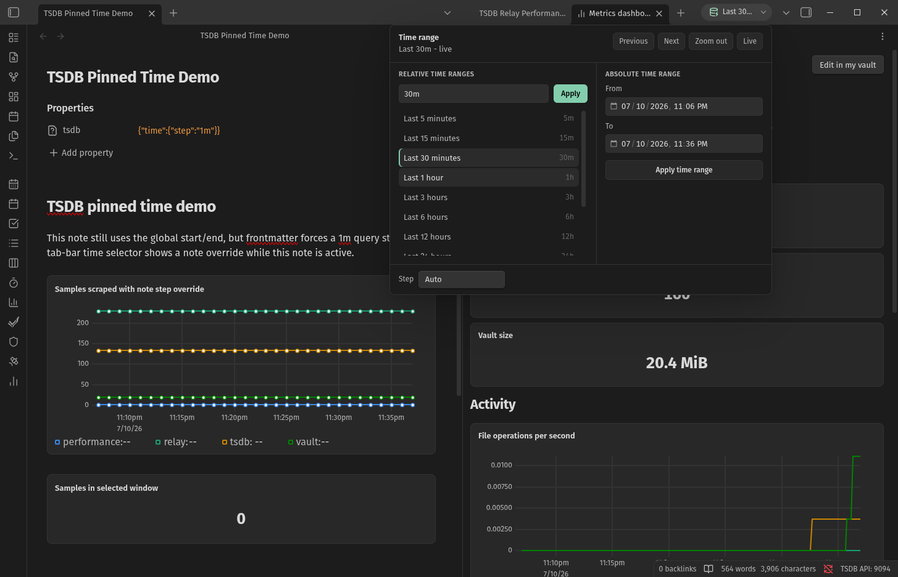

# TSDB

TSDB is a local time-series database for Obsidian. It records metrics from this
vault and from other plugins, stores them in SQLite-backed browser storage, and
renders live charts from PromQL code blocks in notes.

The main workflow stays inside Obsidian: collect local metrics, query the local
database, pin a time range while investigating, and keep dashboards as Markdown
notes. Prometheus HTTP serving and external endpoint scraping are available in
advanced settings.



## Use TSDB in Obsidian

Select the ribbon icon or run **Open metrics dashboard** to view the built-in
dashboard. Select **Edit in my vault** to create a Markdown dashboard note that
you can edit like any other note.

TSDB records from these sources:

- **Vault metrics**: file operations, note counts, vault size, open notes,
  enabled plugins, and note view duration.
- **Performance metrics**: browser memory usage and selected Obsidian API
  timings.
- **Plugin metrics**: metrics registered by other Obsidian plugins.
- **Prometheus scrape targets**: optional external exposition endpoints.

The charting layer, dashboard, and optional HTTP API all query the same local
database.

## Storage

TSDB records metric samples into a SQLite database using `wa-sqlite`. The
database runs in a worker and persists in OPFS (Origin Private File System),
the browser-managed storage area available to Obsidian's renderer.

Metric data lives in OPFS, separate from the plugin files.

Each scrape batch is committed as a SQLite transaction. Retention pruning keeps
the database within the configured history window. The default retention is 30
days; change it in **Settings -> Community plugins -> TSDB -> Database**.

## Charting in notes

TSDB registers a `promql` Markdown code block processor. Add a fenced block to
any note and it renders as a live panel backed by the local database.

### Time series

````markdown
```promql
query: sum by (operation) (rate(obsidian_file_operations_total[5m]))
title: File operations per second
legend: "{{operation}}"
range: 3h
refresh: 30s
```
````

### Stat

````markdown
```promql
query: obsidian_vault_notes_total
type: stat
title: Notes
refresh: 60s
```
````

### Table

````markdown
```promql
query: scrape_samples_scraped
type: table
title: Scrape samples
refresh: 30s
```
````

Panel options:

- `query`: a PromQL expression.
- `queries`: multiple expressions with optional `legend` values.
- `type`: `timeseries`, `stat`, or `table`.
- `title`: panel title.
- `range`: time range for time series panels, such as `1h` or `3h`.
- `step`: query step; omitted means automatic.
- `refresh`: refresh interval; omitted means render once.
- `unit`: display unit, including `bytes`.
- `legend`: label template such as `{{operation}} on {{instance}}`.
- `min`, `max`, `height`: chart display controls.

## Time range selection

PromQL panels use the active dashboard time range. The selector lives in the
workspace tab bar, next to Obsidian's view controls, so the same investigation
window follows you across TSDB dashboard notes.

Dashboard frontmatter can pin a note to a specific query window:

```yaml
tsdb:
  time:
    start: "2026-07-10T23:06:00-07:00"
    end: "2026-07-10T23:36:00-07:00"
    step: 1m
```

Pinned notes still use the global selector UI. The pinned values apply while
that note is active.

## Querying

The charting layer and dashboard query the local TSDB directly. The same engine
also powers the optional Prometheus-compatible HTTP API.

Supported PromQL subset:

- Selectors with `=`, `!=`, `=~`, `!~`, range selectors such as `[5m]`, and
  `offset`.
- `rate`, `irate`, `increase`, `delta`, `idelta`, `changes`, `resets`, and
  `*_over_time` functions for avg, min, max, sum, count, last, present,
  stddev, stdvar, and quantile.
- `histogram_quantile`, `abs`, `ceil`, `floor`, `round`, `sqrt`, `exp`, `ln`,
  `log2`, `log10`, `sgn`, `clamp`, `clamp_min`, `clamp_max`, `scalar`,
  `vector`, `time`, `absent`, `sort`, and `sort_desc`.
- Aggregations: `sum`, `avg`, `min`, `max`, `count`, `stddev`, `stdvar`,
  `quantile`, `topk`, and `bottomk` with `by` and `without`.
- Binary operators: arithmetic, comparisons including `bool`, `and`, `or`,
  `unless`, and one-to-one vector matching with `on` and `ignoring`.

Unsupported PromQL features include subqueries, `@` modifiers, `group_left`,
`group_right`, `label_replace`, and `label_join`.

## Plugin registration

Other plugins register metrics by claiming a named store. A store is recorded
into the local database at its own interval, and the store name becomes the
`job` label for stored samples.

Copy `obsidian-metrics.d.ts` into your plugin for type-safe access.

```typescript
import { Plugin } from "obsidian";
import {
	IObsidianMetricsRootAPI,
	IObsidianMetricsAPI,
	MetricInstance,
	ObsidianMetricsPlugin,
} from "./obsidian-metrics";

export default class MyPlugin extends Plugin {
	private metrics: IObsidianMetricsAPI | undefined;
	private documentSize: MetricInstance | undefined;

	async onload() {
		this.registerEvent(
			this.app.workspace.on("tsdb:ready", (api: IObsidianMetricsRootAPI) => {
				this.registerMetrics(api);
			})
		);

		const tsdb = this.app.plugins.plugins["tsdb"] as
			| ObsidianMetricsPlugin
			| undefined;
		if (tsdb?.api) {
			this.registerMetrics(tsdb.api);
		}
	}

	private registerMetrics(rootApi: IObsidianMetricsRootAPI) {
		const api = rootApi.getStore("my-plugin", {
			intervalSeconds: 30,
			displayName: "My plugin metrics",
			description: "Document size and activity metrics.",
		});

		this.metrics = api;
		this.documentSize = api.createGauge({
			name: "my_document_size_bytes",
			help: "Size of documents in bytes.",
			labelNames: ["document"],
		});
	}

	updateDocumentSize(document: string, bytes: number) {
		this.documentSize?.labels({ document }).set(bytes);
	}
}
```

Registration is idempotent. `tsdb:ready` fires after Obsidian's workspace layout
and the local database are ready. If TSDB reloads, it fires again and your plugin
should recreate its store and metric references.

### Metric types

TSDB exposes the familiar Prometheus metric types through `prom-client`:

```typescript
const counter = api.createCounter({
	name: "requests_total",
	help: "Total requests.",
	labelNames: ["route"],
});
counter.inc(1, { route: "search" });

const gauge = api.createGauge({
	name: "queue_depth",
	help: "Current queue depth.",
});
gauge.set(12);

const histogram = api.createHistogram({
	name: "operation_duration_seconds",
	help: "Operation duration.",
	labelNames: ["operation"],
	buckets: [0.01, 0.05, 0.1, 0.5, 1, 5],
});
const stop = histogram.startTimer({ operation: "index" });
// do work
stop();
```

Convenience helpers are also available:

```typescript
api.counter("button_clicks_total", "Button click count.").inc();
api.gauge("active_documents", "Open document count.", 3);
api.histogram("request_duration_seconds", "Request duration.");
```

## Settings

Open **Settings -> Community plugins -> TSDB**.

Key settings:

- **Sources**: enable or disable local metric sources, set recording intervals,
  and add Prometheus scrape targets.
- **Database**: set retention and view the active OPFS database status.
- **HTTP API**: enable the local Prometheus-compatible server and set the port
  or port range.
- **Advanced**: set the metric prefix.

The HTTP server is disabled by default. Local recording and note charting do
not require it.

## Advanced: Prometheus interop

TSDB can both expose a Prometheus-compatible server and scrape Prometheus
endpoints. These features are optional and use local HTTP by default.

### Expose a Prometheus server

Enable **Serve metrics over HTTP** in settings to bind a local server. The
default port range is `9090-9099`, so several vaults can run at the same time.

Available endpoints:

| Endpoint | Notes |
| --- | --- |
| `/metrics` | Prometheus text exposition for current in-process metrics |
| `/health` and `/-/healthy` | Health checks |
| `/api/v1/query` | Instant queries with `query` and optional `time` |
| `/api/v1/query_range` | Range queries with `query`, `start`, `end`, and `step` |
| `/api/v1/series` | Series discovery with `match[]` selectors |
| `/api/v1/labels` | Label name discovery |
| `/api/v1/label/<name>/values` | Label value discovery |
| `/api/v1/status/buildinfo` | Build information |
| `/api/v1/status/tsdb` | Local TSDB status |
| `/api/v1/export` | JSON-lines export |

Grafana can use TSDB as a Prometheus datasource by pointing it at the bound
base URL, for example `http://localhost:9090`.

Because the server can bind any port in the configured range, TSDB also exposes
a Chrome DevTools Protocol helper:

```js
window.__tsdb?.getInfo();
// { vault, vaultId, pluginVersion, serverRunning, port, metricsPath, baseUrl }
```

The same helper exposes `getStats()`, `getScrapeStatuses()`, `query(expr)`, and
`queryRange(expr, startMs, endMs, stepMs)` for local tooling and tests.
With the worker-OPFS backend, PromQL evaluation runs in the storage worker so
only the final query result is transferred to Obsidian's renderer.

### Scrape Prometheus endpoints

Add scrape targets in settings with one or more target URLs, such as:

```text
http://localhost:9100/metrics
```

Each target is scraped into the local database. TSDB adds Prometheus-style
`job` and `instance` labels, preserves colliding target labels as
`exported_job` and `exported_instance`, and records synthetic scrape health
series:

- `up`
- `scrape_duration_seconds`
- `scrape_samples_scraped`

External scraping is useful when you want Obsidian to keep a local history of a
nearby app, development service, or machine exporter without running a separate
Prometheus instance.

## Developing this plugin

This plugin directory builds an Obsidian community plugin. The release
artifacts are `main.js`, `manifest.json`, and `styles.css`.

```bash
npm install
npm run build:tsdb-wasm
npm run build
npm run dev
npm test
```

The Wasm build uses Docker, pins Emscripten and the wa-sqlite source revision,
and installs the generated `.mjs`/`.wasm` pair into `node_modules`. Builds
verify that this custom artifact is present before bundling.

Run release checks with:

```bash
npm run release
```

`main.js` is a generated release artifact and is ignored by git.

## Project structure

```text
tsdb/
+-- src/
|   +-- main.ts              # Plugin lifecycle and wiring
|   +-- settings.ts          # Settings model and defaults
|   +-- labels.ts            # Label sets and matchers
|   +-- types.ts             # Public metric API types
|   +-- exporter/            # prom-client registry, public API, built-ins
|   +-- scrape/              # Exposition parser and scrape scheduler
|   +-- storage/             # wa-sqlite TSDB, OPFS worker, recovery WAL
|   +-- promql/              # PromQL AST, parser, and engine
|   +-- panels/              # Markdown panel config and rendering data
|   +-- api/                 # HTTP server and /api/v1 routes
|   +-- ui/                  # Settings, modal, and dashboard view
+-- tests/                   # Vitest suites
+-- obsidian-metrics.d.ts    # Public type declarations
+-- manifest.json            # Plugin manifest
+-- package.json             # npm scripts and dependencies
```

## License

MIT License
